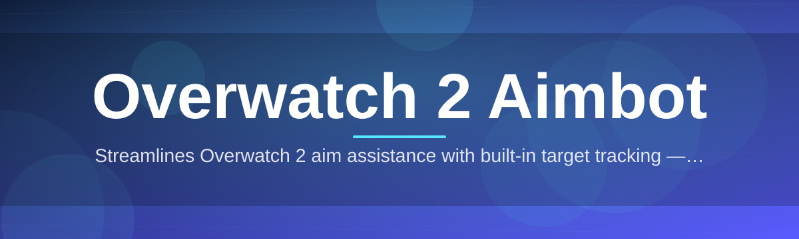

# overwatch2-aim-assistant

Streamlines Overwatch 2 aim assistance with built-in target tracking — single binary

  

## Overview

Streamlines Overwatch 2 aim assistance with built-in target tracking — single binary

## License

[MIT License](LICENSE)
